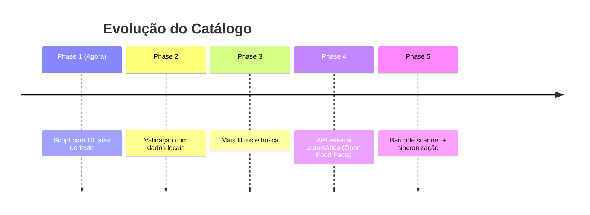

# 🗂️ Opções para Carregar Dados do Catálogo

## Resumo Visual

```
┌─────────────────────────────────────────────────────────────┐
│         CARREGANDO DADOS NA MONSTER VAULT                  │
└─────────────────────────────────────────────────────────────┘

          ┌──────────────────┬──────────────────┬──────────────────┐
          │  OPÇÃO 1         │  OPÇÃO 2         │  OPÇÃO 3         │
          │  Script Node.js  │  Firebase        │  API Externa     │
          │  (Automática)    │  Console         │  (Futuro)        │
          │  ⚡ RÁPIDA       │  (Manual)        │  (Phase 4)       │
          │  ✅ 10 latas    │  ✅ 10 latas    │  ✅ Muito Dados  │
          └──────────────────┴──────────────────┴──────────────────┘
```

---

## 🎯 Opção 1: Script Automático (RECOMENDADO)

**Mais fácil e rápido!**

### Pré-requisitos:
- [ ] Gerar `serviceAccountKey.json` no Firebase Console
- [ ] Colocar arquivo na raiz do projeto

### Passo-a-Passo:

#### 1️⃣ Gerar Chave Privada
```
Firebase Console
  ↓
Project Settings (⚙️)
  ↓
Service Accounts
  ↓
Generate New Private Key
  ↓
Salvar como: serviceAccountKey.json
```

#### 2️⃣ Colocar Arquivo
```bash
/workspaces/monster-vault/serviceAccountKey.json
```

#### 3️⃣ Executar Script
```bash
node scripts/seedFirestore.js
```

#### 4️⃣ Pronto! ✅

---

## 📋 Opção 2: Firebase Console (Manual)

**Para quem quer ver os dados sendo criados**

### Passo-a-Passo:

1. Acesse [Firebase Console](https://console.firebase.google.com/)
2. Selecione **monster-vault-4a4c8**
3. **Firestore Database** → **Criar Coleção**
4. Nome da coleção: `cans`
5. **Adicionar Documento** com dados:

```json
{
  "id": "monster-ultra-violet",
  "name": "Monster Ultra Violet",
  "flavor": "Grape",
  "description": "Sabor de uva refrescante",
  "category": "Ultra",
  "size": "473ml",
  "country": "USA",
  "releaseYear": 2021,
  "imageUrl": "https://via.placeholder.com/200x400?text=Ultra+Violet",
  "barcode": "5060567000022",
  "caffeine": 80,
  "sugar": 0,
  "discontinued": false,
  "createdAt": "2021-01-01T00:00:00Z",
  "updatedAt": "2021-01-01T00:00:00Z"
}
```

**⚠️ Tedioso:** Precisa repetir para cada uma das 10 latas...

---

## 🌐 Opção 3: API Externa (Futuro)

**Implementado em Phase 4**

### Dados Disponíveis:

**Open Food Facts** (Recomendado)
- Base: https://world.openfoodfacts.org/
- Endpoint: `/api/v2/search?q=Monster`
- Vantagem: 1000+ produtos Monster

**Barcode Lookup API**
- Suporta busca por código de barras
- Dados completos de produtos
- Boa precisão

**Custom Scraper**
- Coletar dados do site oficial Monster
- Mais preciso mas complexo

### Como Funciona (Phase 4):

```
Cloud Function (Daily)
  ↓
Busca API Externa
  ↓
Normaliza Dados
  ↓
Atualiza Firestore
  ↓
App Carrega Dados
```

---

## 🚀 Recomendação

**AGORA:** Use **Opção 1** (Script) para testes rápidos

**DEPOIS:** Implemente **Opção 3** (API) para dados completos



---

## 📊 Comparação

| Aspecto | Opção 1 | Opção 2 | Opção 3 |
|---------|---------|---------|---------|
| **Velocidade** | ⚡ 30 segundos | 🐌 15 minutos | 🚀 Automática |
| **Quantidade** | 10 latas | 10 latas | 1000+ latas |
| **Esforço** | Mínimo | Alto | Médio (setup inicial) |
| **Quando Usar** | Desenvolvimento | Aprendizado | Produção |
| **Status** | ✅ Pronto | ✅ Pronto | 🚧 Phase 4 |

---

## ❓ Precisa de Ajuda?

Veja `docs/SEED_GUIDE.md` para instruções detalhadas!
